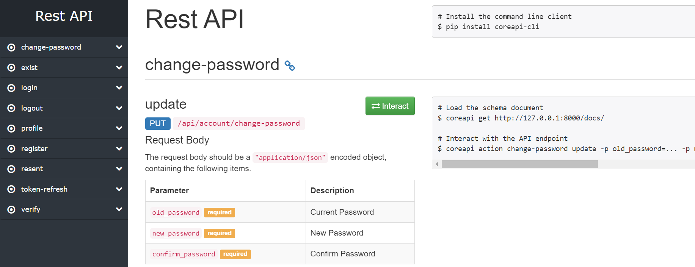

# Django Restful API For Custom Authentication
Django restful api login with Email and Mobile no. In this we get custom created authentication system.
We can register with our mobile or email after register verification OTP sent to email and mobile.
Both email and mobile has different OTP. so when user input the OTP from email then email verified and
if OTP input from mobile then mobile varified. User also sent the resent OTP if mail or SMS not found.

##  Branch

##### development: 
compatible with >=django 3.0

##### Master: 
compatible with django2.0

##### django_v3: 
compatible with >=django3.0

## Installation

1. Download or clone project from git.
   

      for WINDOWS Install Git Bash 

      https://git-scm.com/downloads

      after install the Git Bash 
      
      git clone https://github.com/harryanand060/django_rest.git

2. Create project with virtual environment also install pip [pip](https://pip.pypa.io/en/stable/).

3. Install prerequisites  


    ```bash
       pip isntall -r requirement.txt
    ```
(after coping the project to your directory where you create projcet).

4. Inside app we have .env.test rename to .env and then update 
    
    
    Generate SECRET_KEY
      
    python manage.py generate_key -sp -d app
        
    Database Settings

        DATABASE_NAME=db_name
        DATABASE_USER=root
        DATABASE_PASSWORD=
        DATABASE_HOST=localhost
   
    EMAIL Setting
    
    EMAIL_HOST_USER = '**********@gmail.com'
    EMAIL_HOST_PASSWORD = '*******'.
    
    SMS Getway Setting

     'url': 'http://sms.abc.com/sendSMS',
     'apikey': '**********************',
     'username': '*****************',
     'sendername': '**************',
     'smstype': '***********'.
    

5. now open terminal and path set to your current project and run
   

    ```bash
        python manage.py makemigrations
    ```
    ```bash
        python manage.py migrate
    ```

6. now create super user


       ```bash
            python manage.py createsuperuser
       ```

   and follow the steps.

7. now Run
   

    ```bash
        python manage.py runserver
    ```

#Testing



Open the browser with given runserver IP for ex: http://127.0.0.1:8000/
Here you get all the listed API Docs


